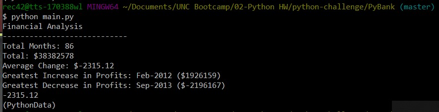

Alt-python-challenge: Using Python to Analyze Datasets
======================================================
Version: 1.0.0

Alt-Description
---------------
The purpose of this program is to analyze large datasets that are stored in Excel files in a descriptive manner.

### PyBank
This script analyzes profits and losses per month.

As can be seen from the results below, the greatest decrease in the month-to-month returns occurred in MONTH HERE.  The greatest increase in the month-to-month returs occurred in MONTH HERE.

### PyPoll
This script analyzes election data to determine the winner of the race.

As can be seen below, the winner of the election was Khan.

Alt-Instructions
----------------
PyPoll checks for duplicate voterIDs to ensure that no individual votes twice. Due to the large size of the dataset, this program may run slowly depending on your machine capabilities. 

Alt-Contributors
----------------
Rebekah Callari-Kaczmarczyk

Alt-License and Copyright
--------------------------
&copy; Rebekah Callari-Kaczmarczyk